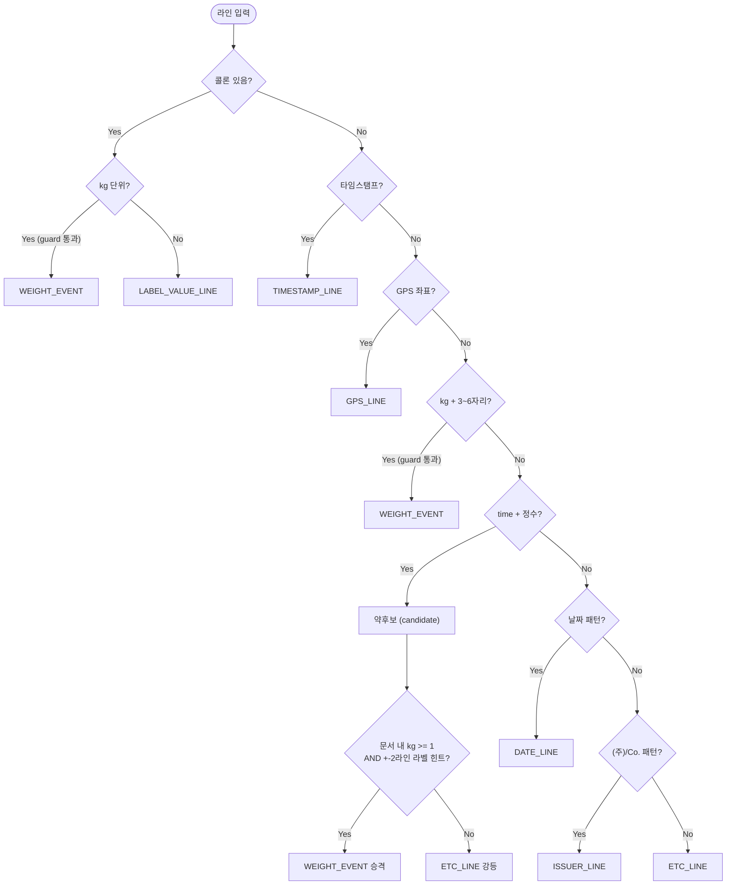
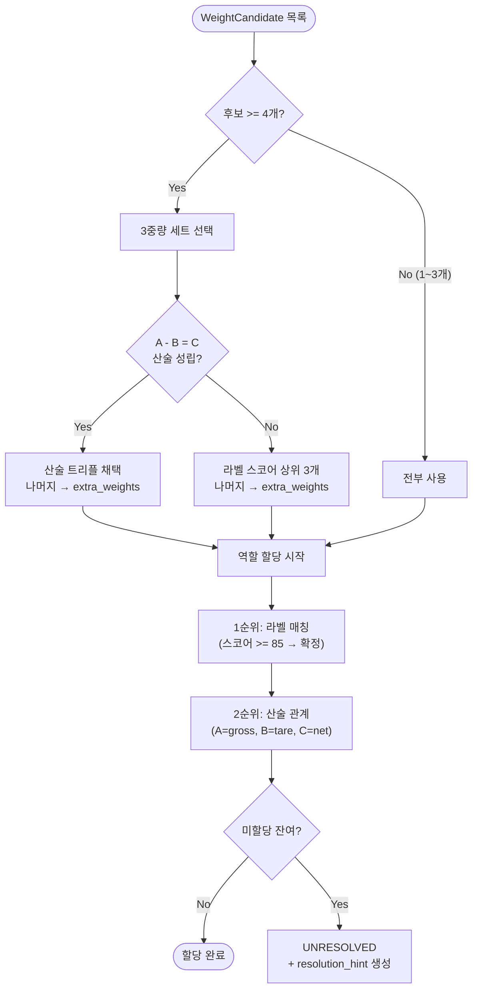

# 시퀀스 다이어그램

## 메인 파이프라인

```mermaid
sequenceDiagram
    participant App as Application
    participant Pre as Preprocessor
    participant Ext as Extractor
    participant FA as FieldAssigner
    participant Nor as Normalizer
    participant Val as Validator

    App->>App: OCR JSON 파일 읽기 (Jackson)
    App->>Pre: process(OcrInput)

    Note over Pre: Step 1. 라인 분리<br/>Step 2. 한글 자모 공백 제거<br/>Step 3. 노이즈 마킹 (삭제/플래그)<br/>Step 4. 라인 병합
    Pre-->>App: List&lt;ProcessedLine&gt;

    App->>Ext: classifyLines(processedLines)
    Note over Ext: Value-First 라인 분류<br/>→ 약후보 승격/강등
    Ext-->>App: List&lt;ClassifiedLine&gt;

    App->>FA: assign(classifiedLines, sourceFile)
    Note over FA: 중량 후보 파싱<br/>→ 3중량 세트 선택<br/>→ 역할 할당 (라벨→산술→UNRESOLVED)<br/>→ 라벨:값 필드 할당<br/>→ 기타 라인 처리
    FA-->>App: ParsedDocument (raw)

    App->>Nor: normalize(doc)
    Note over Nor: 날짜→YYYY-MM-DD<br/>시간→HH:MM:SS<br/>중량→int, 단위→kg
    Nor-->>App: ParsedDocument (normalized)

    App->>Val: validate(doc)
    Note over Val: 산술 검증<br/>양수/최대값 검증<br/>날짜 유효성<br/>필수 필드 확인<br/>→ is_consistent, is_actionable
    Val-->>App: ParsedDocument (final)

    App->>App: JSON 출력 (stdout 또는 파일)
```

## Extractor 라인 분류 상세



## FieldAssigner 중량 역할 할당 상세


